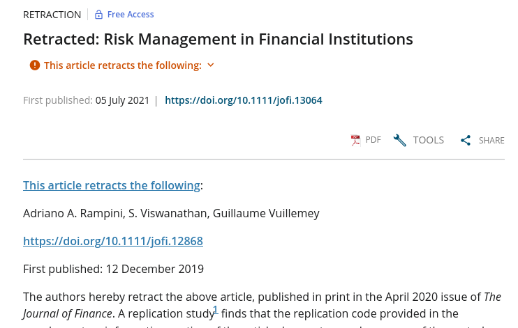

```{r, child=c('toc.md')}
```

## Reproducibility

::: {.columns-2}

:::: {.column}

- ... is efficient
- ... is memory

::::

:::: {.column}

- ... is integral to your research
- ... is integral to scientific progress


::::

:::

# Reproducibility is efficient

## Reproducibility is efficient

Suppose you have a sequence of programs for your thesis paper no. 1.

- Your presentation to the department is tomorrow.
- In reviewing your slides, you realize that there's something fishy about the data cleaning....
- You realize - with horror - that you have to re-run everything...


## Reproducibility is efficient

With reproducibility, that is easy:

 - simply run everything again, from A-Z
 
## Reproducibility is efficient

What if that takes several days (or weeks) to run?


# Reproducibility is memory

## Reproducibility is memory

You have now successfully presented your thesis paper, and wrap it up.

- Even your thesis, after 2 other papers.
- You've submitted your paper no. 1
- One year later, you get reviews back. You haven't touched your paper since.

How long does it take you to get back up to speed?

> Your past "you" is not answering from present "you"  any emails with queries about how to run the code!


## Reproducibility is memory ... and efficient

You now want to delegate updating the data to an RA. What do you do?


# Reproducibility is integral to your research

## Reproducibility is integral to your research

In the words of the slogan popularized by Buckheit and Donoho (1995),

> “a scientific publication is [...] merely advertising of the scholarship: [...] the complete software
development environment and the complete set of instructions which generated the figures.”


# Reproducibility is integral to scientific progress


## Reproducibility is integral to scientific progress

Building on the work of others:

- citing their work
- re-using their efforts to clean data, to run analyses, etc.

## Examples of building on others

Jonathan Roth, "Pre-test with Caution: Event-Study Estimates after Testing for Parallel Trends", AER:I forthcoming.

[https://www.aeaweb.org/articles?id=10.1257/aeri.20210236](https://www.aeaweb.org/articles?id=10.1257/aeri.20210236)

> paper conducts simulations based on 12 papers published previously in AEA

## Examples of building on others

Rachael Meager, "Understanding the Average Impact of Microcredit Expansions: A Bayesian Hierarchical Analysis of Seven Randomized Experiments"

[https://doi.org/10.1257/app.20170299](https://doi.org/10.1257/app.20170299)

> jointly estimate the average effect and the heterogeneity in effects across seven studies using Bayesian hierarchical models

## Examples of building on others

Papers in the minimum wage literature


## Reproducibility is integral to scientific progress

Careful when it fails:

> Journal of Finance, "Retracted: Risk Management in Financial Institutions", *Journal of Finance*, [https://doi.org/10.1111/jofi.13064](https://doi.org/10.1111/jofi.13064)



# Next up: What you can do

[Implementing reproducibility](part1a.html)

