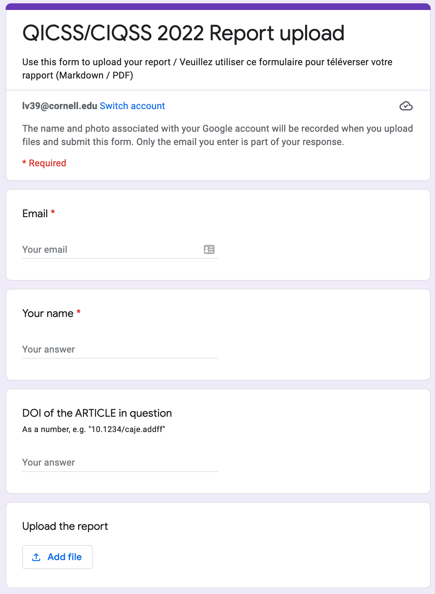

```{r, child=c('toc.md')}
```

# Some resources

## Example solution for the test case

[REPLICATION.pdf](
https://labordynamicsinstitute.github.io/replicability-training-solutions/imperfect-example/REPLICATION.pdf)


## A template


- [Template Report repository](https://github.com/AEADataEditor/replication-template/blob/master/REPLICATION.md)
  - [the actual Template Report used by AEA](https://github.com/AEADataEditor/replication-template/blob/master/REPLICATION.md)
  - [the template-config.do](https://github.com/AEADataEditor/replication-template/blob/11d1ae2a2db7c5a61ac4e8dcb4fecd1b47d543ec/template-config.do#L64) - you may need to adjust the `$rootdir` in your Stata code. This code should be inserted into any "main" file, or the entire "template-config.do" downloaded and included with the code "`include "config.do"`"

## List of articles

The list of CJE articles that are eligible for reproducibility checks and replication enhancements is 

[this Google Sheet](https://docs.google.com/spreadsheets/d/1ahZc4jsNSfApMHHkjp7TTh0jFdZG3LTZTIWllU4E4UA/edit#gid=0)

If you cannot see the spreadsheet, please request access.

## Uploading reports

Upload your finished reports (whenever that happens) to the link provided on the "[Upload tab](https://docs.google.com/spreadsheets/d/1ahZc4jsNSfApMHHkjp7TTh0jFdZG3LTZTIWllU4E4UA/edit#gid=438016711)" of the above Spreadsheet (the form is not public, to avoid spam).



You'll be asked for email, name, and the DOI of the manuscript/ARTICLE, e.g. only the numeric part (same as in Column A of the spreadsheet): "10.1111/caje.12559", then upload the report (in Markdown or PDF format).

